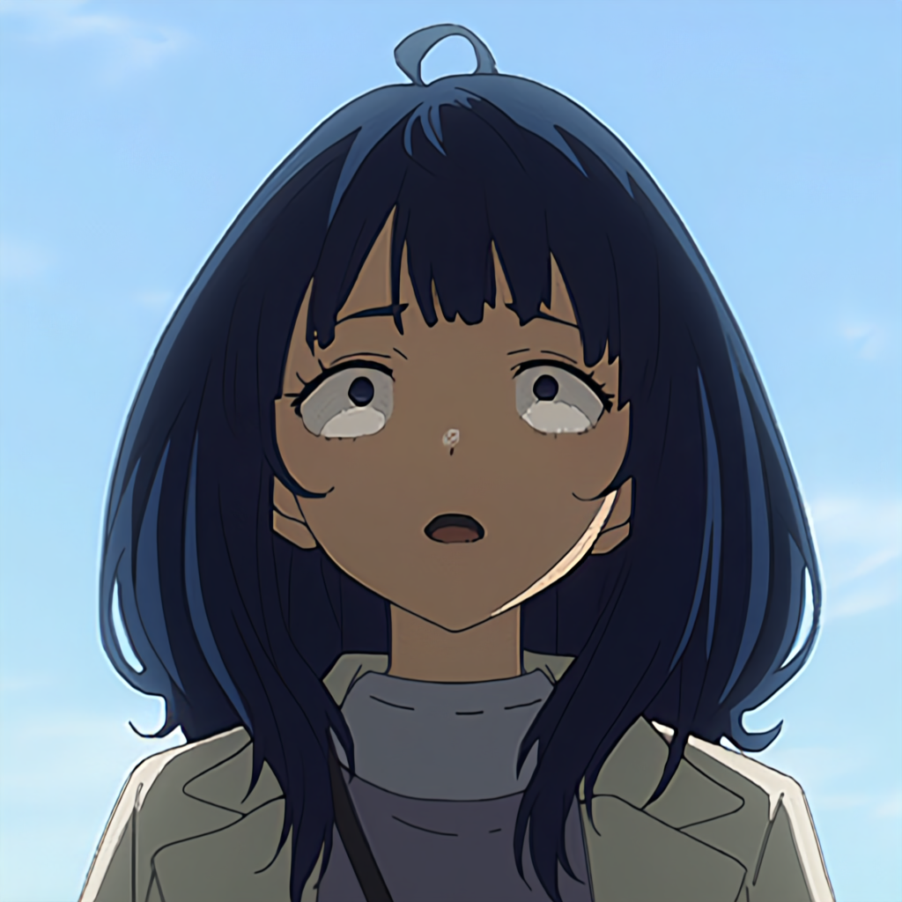
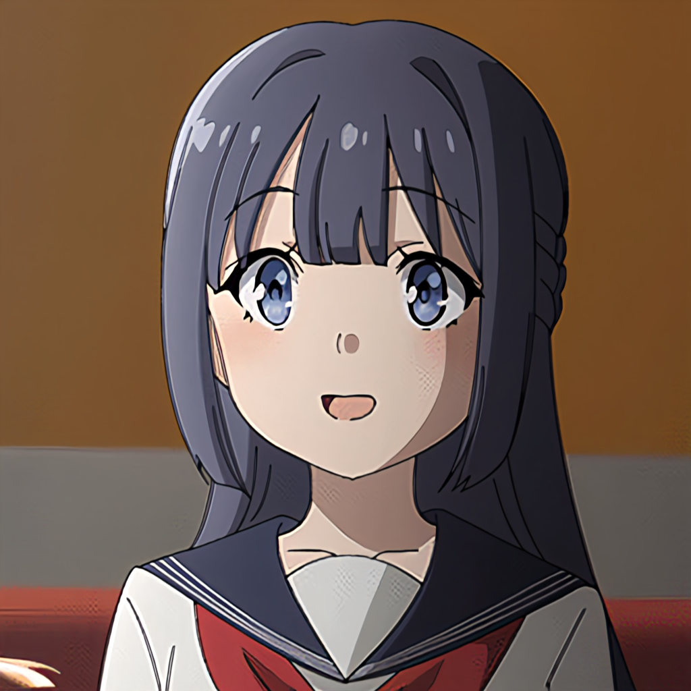
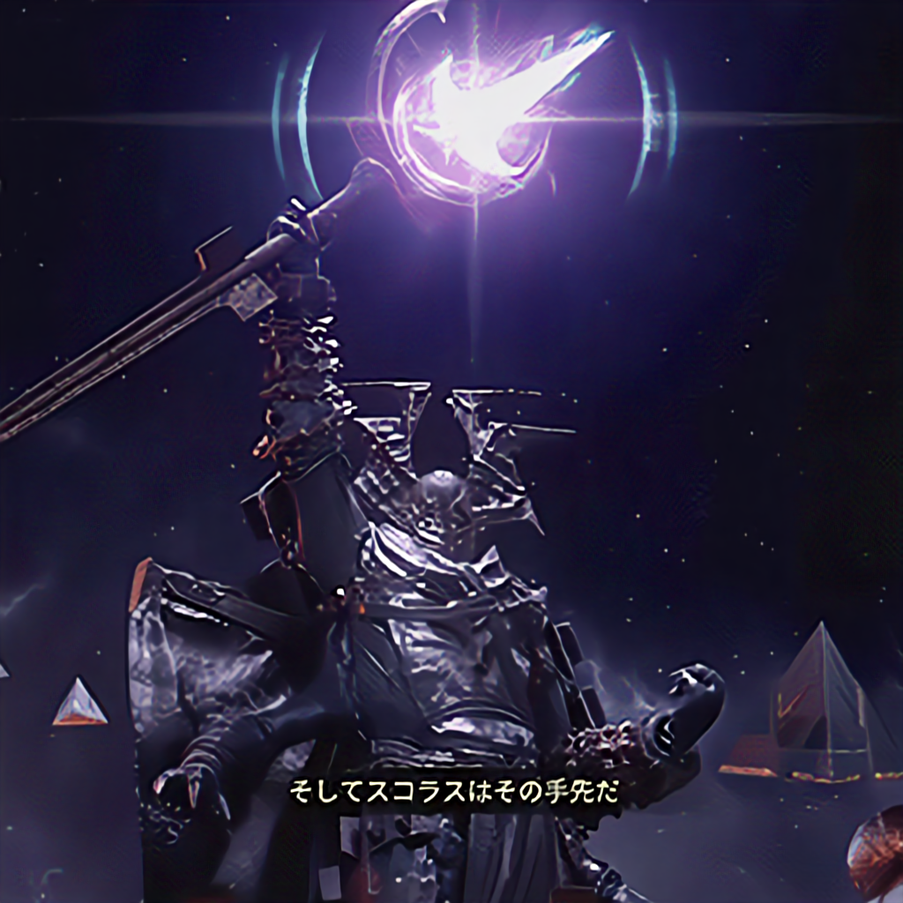

# Anime Image Upscaling with Fine-Tuned Real-ESRGAN (M-ERSGAN)
Muhammad Hafiz Bin Abdul Halim : dragonstonehafiz@gmail.com

[Muhammad Azreen Bin Muhammad](https://github.com/The1Azreen) : azreen654@gmail.com

Muhammad Firdauz Bin Kamarulzaman : email@firdauzbk.com


## Project Description

### Background  
In this project, we explored a variety of Deep Learning models to upscale anime images.  
After thorough testing and comparison, the R-ESRGAN 4x model demonstrated the best results.  
Our goal is to fine-tune the R-ESRGAN model specifically for anime and anime upscaling tasks.

---

## Methodology/Proposed Approach

1. **Dataset Preparation**  
   - We sourced our image dataset from existing anime content.
   - The size of the dataset is subject to change over the duration of the project.  

2. **Data Annotation and Preprocessing**  
   - Annotate the dataset for relevant features.
   - We run the Python code in the imageGenCode folder to annotate the images in 3 Categories
   - Generate low-resolution image variants to simulate input for the model.
     
3. **Training**  
   - Annotate the dataset for relevant features.
   - We run the Python code in the imageGenCode folder to annotate the images in 3 Categories
   - Generate low-resolution image variants to simulate input for the model.
  


---

## Results: Image Comparison

Below is a comparison between a low-quality anime image and its upscaled version using our fine-tuned model:

| Low-Quality Image                          | Upscaled Image                 |
|--------------------------------------------|--------------------------------|
|  |  |
|  |  |
|  |  |
|  |  |
---


## How to Use (Upscaling App)

1. **Clone the Repository**  
   ```bash
   git clone https://github.com/dragonstonehafiz/aai3001-large-project.git
   
2. **Run the application through Streamlit**
   ```bash
   streamlit run streamlit_app.py

3. **Example Usage**
   
   [Video Link](https://youtu.be/zZiL5X7dj4A?si=0ImNYT7CJmsfBnHC)

## How to Use (Image Generation for Training)

* **How to generate images for training.**
   - Image generation only works with `.mkv` files.
   - Animes should be stored as below.
   - First run `frames_extract.py`, then `frames_downsample.py`, then `frames_gen_csv.py`.
   ```markdown
   imageGenCode/
   ├── anime1/
   │   ├── episode1.mkv
   │   ├── episode2.mkv
   │   └── episode3.mkv
   ├── anime2/
   │   ├── episode1.mkv
   │   ├── episode2.mkv
   │   └── episode3.mkv
   ├── anime3/
   │   ├── episode1.mkv
   │   ├── episode2.mkv
   │   └── episode3.mkv
   ├── frames_downsample.py
   ├── frames_extract.py
   ├── frames_gen_csv.py
   └── frames_rename.py
   ```
