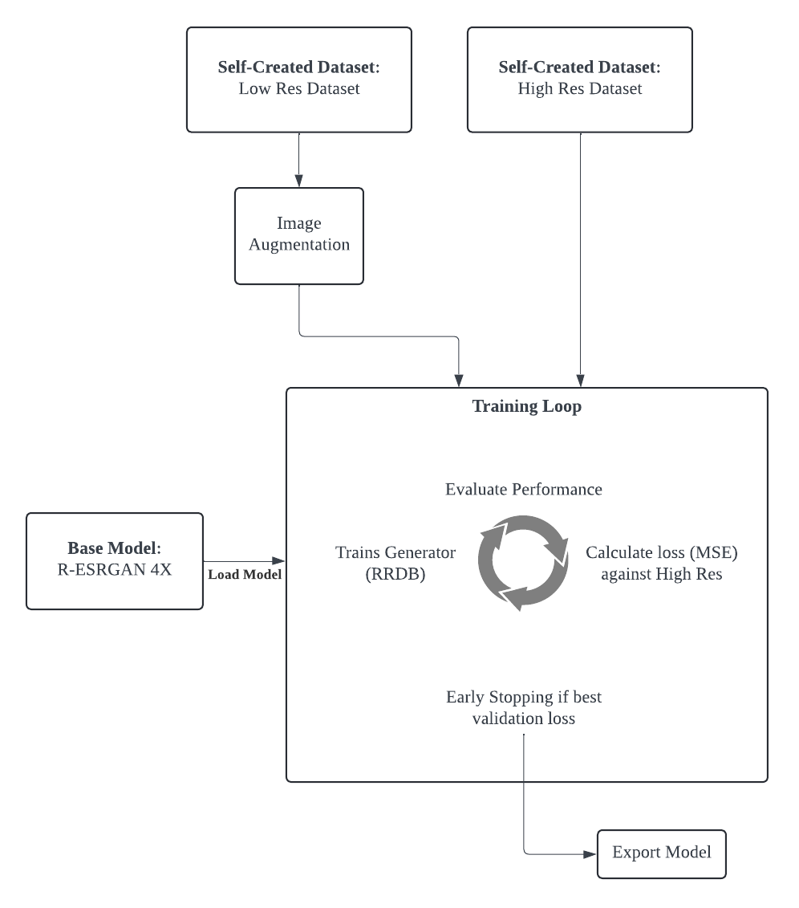
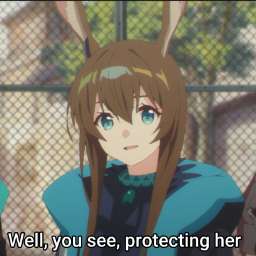
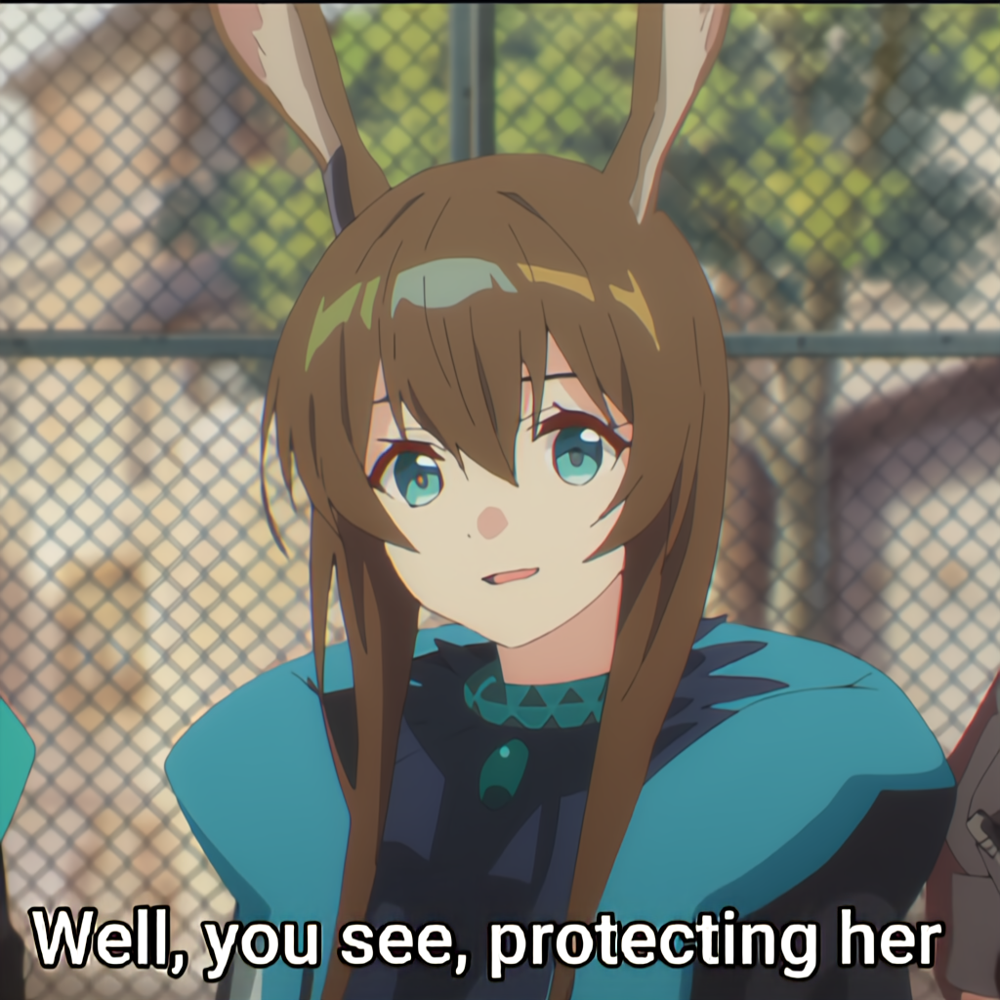
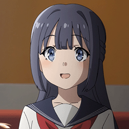

# Anime Image Upscaling with Fine-Tuned Real-ESRGAN
Muhammad Hafiz Bin Abdul Halim : 

Muhammad Azreen Bin Muhammad : azreen654@gmail.com

Muhammad Firdauz Bin Kamarulzaman : email@firdauzbk.com


## Project Description

### Background  
In this project, we explored a variety of Deep Learning models to upscale anime images.  
After thorough testing and comparison, the R-ESRGAN 4x model demonstrated the best results.  
Our goal is to fine-tune the R-ESRGAN model specifically for anime and anime upscaling tasks.

---

## Methodology/Proposed Approach

1. **Dataset Preparation**  
   - We sourced our image dataset from existing anime content.
   - The size of the dataset is subject to change over the duration of the project.  

2. **Data Annotation and Preprocessing**  
   - Annotate the dataset for relevant features.
   - We run the Python code in the imageGenCode folder to annotate the images in 3 Categories
   - Generate low-resolution image variants to simulate input for the model.
     
3. **Training**  
   - Annotate the dataset for relevant features.
   - We run the Python code in the imageGenCode folder to annotate the images in 3 Categories
   - Generate low-resolution image variants to simulate input for the model.
  



---

## Results: Image Comparison

Below is a comparison between a low-quality anime image and its upscaled version using our fine-tuned model:

| Low-Quality Image                          | Upscaled Image                 |
|--------------------------------------------|--------------------------------|
|  |  |
|  |  |
|  |  |
|  |  |
---


## How to Use

1. **Clone the Repository**  
   ```bash
   git clone https://github.com/yourusername/yourrepository.git
   cd yourrepository
